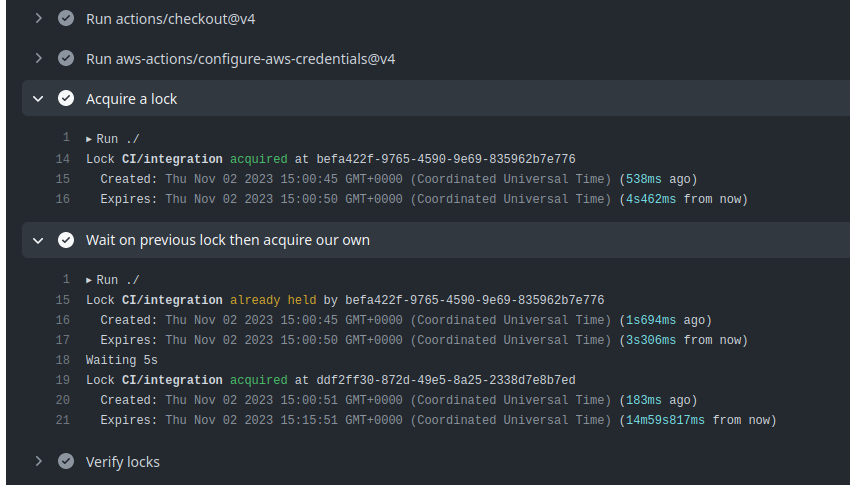

# AWS S3 Lock

Wait for, acquire, and release a distributed lock via S3 storage.

## Usage

```yaml
- uses: aws-actions/configure-aws-credentials@v4
  with:
    # ...

# This blocks until the lock is acquired, or errors if timeout is reached
- uses: freckle/aws-s3-lock-action@v1
  with:
    # Required
    bucket: an-existing-s3-bucket

    # Optional, defaults shown
    # name: {workflow}/{job}
    # expires: 15m
    # timeout: {matches expires}
    # timeout-poll: 5s
    # context: "{workflow} #{run}"

- run: echo "Lock held, do work here"
```



The lock is released (the S3 object deleted) in our Post step, which provides a
pretty robust guarantee of release. Expired locks are ignored (not deleted), so
it's recommended you put a Lifecyle policy on the Bucket to clean them up after
some time.

## Inputs and Outputs

See [action.yml](./action.yml) for a complete list of inputs and outputs.

## Implementation Details

### Algorithm

This tool implements a version of the locking algorithm described in this
[StackOverflow answer][answer].

[answer]: https://stackoverflow.com/questions/45222819/can-pseudo-lock-objects-be-used-in-the-amazon-s3-api/75347123#75347123

- Upload a lock object to S3 at `<name>.<created>.<uuid>.<expires>`

  All time values are milliseconds since epoch.

- List all other lock objects (prefix `<name>.`)

  Filter out any expired keys (looking at `expires`) and sort, which implicitly
  means by `created` then `uuid` as desired.

- If the first one (i.e. oldest) is our own, we've acquired the lock
- If not, we lost the race; remove our object, wait, and try again

### Ordering Semantics

Each time we attempt to acquire the lock, we create a new key name (e.g.
`<created>` and `<expires>` both change), this effectively loses our "place in
line" but ensures that expiry is measured from time of acquisition and not time
of first attempt. There are trade-offs either way, and possible room for
improvement, so this is just how we're doing it for now.

### Caveat

**This tool is not meant to be bullet-proof**. We built it for our needs and
accept that there are simply no strong guarantees in this locking mechanism's
operation at scale. Your mileage may vary; patches welcome.

## Versioning

Versioned tags will exist, such as `v1.0.0` and `v2.1.1`. Branches will exist
for each major version, such as `v1` or `v2` and contain the newest version in
that series.

### Release Process

Given a latest version of v1.0.1,

Is this a new major version?

If yes,

```console
git checkout main
git pull
git checkout -b v2
git tag -s -m v2.0.0 v2.0.0
git push --follow-tags
```

Otherwise,

```console
git checkout main
git pull
git checkout v1
git merge --ff-only -
git tag -s -m v1.0.2 v1.0.2    # or v1.1.0
git push --follow-tags
```

---

[LICENSE](./LICENSE)
